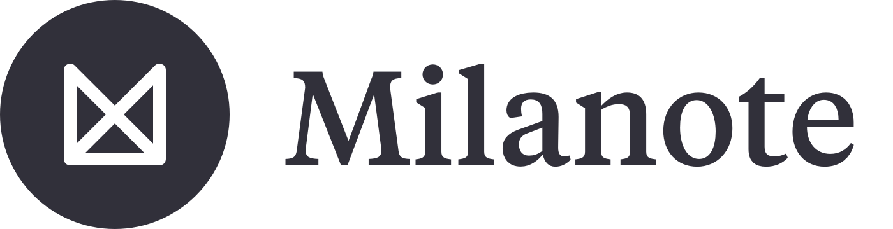

### Hi there 👋
### You've reached the profile of Money Making Tornado

  
  

Hry I'm 'MoneyMakingTonrnado', however I may be reffered to Ahsan Is Epic within my other creations. I've participated in many projects, both as an individual and in teams working with others more greater than me! Some of my public contributes as a programmer are available here to view on my github profile. Some technologys I have tried out are: Game Design in Unity and Unreal, Automations/bots via Twitters, Discords and ProQuants (Discontinued) APIS, taking part in robotics competitons and I still have much more I want to explore.

### Some of my ideas I had over the years

  

### How to Reach Me

  
  &#8205;&#8205;&#8205;&#8205; 
  

---

<!--
**MoneyMakingTornado/MoneyMakingTornado** is a ✨ _special_ ✨ repository because its `README.md` (this file) appears on your GitHub profile.

Here are some ideas to get you started:

- 🔭 I’m currently working on ...
- 🌱 I’m currently learning ...
- 👯 I’m looking to collaborate on ...
- 🤔 I’m looking for help with ...
- 💬 Ask me about ...
- 📫 How to reach me: ...
- 😄 Pronouns: ...
- ⚡ Fun fact: ...
-->
